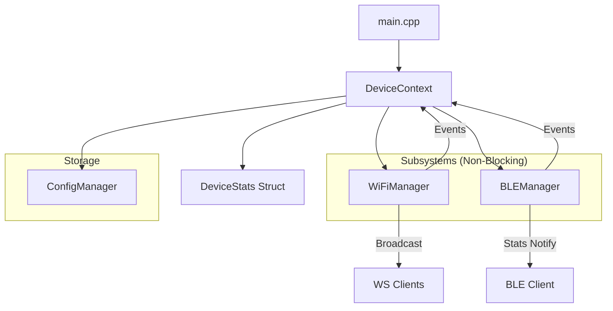

## OpenVibe-Embedded

Small ESP32 firmware for OpenVibe devices. The firmware provides a robust, non-blocking architecture for managing device state, BLE communication, and multiple Wi‑Fi transport modes (Local WebSocket and Remote WebSocket).

## Core Architecture

The project follows a **Singleton-based Component Architecture**. At its heart is the `DeviceContext`, which orchestrates all subsystems and maintains the source of truth for device state.



### Key Design Principles

- **Singleton Pattern**: Managed components like `DeviceContext` and `ConfigManager` are singletons, ensuring a single source of truth and easy access across translation units without global variables.
- **Non-Blocking Logic**: All network operations (Wi-Fi connection, WebSocket retries) use asynchronous state machines. The main loop never blocks, ensuring the device remains responsive and BLE connections stable.
- **Decoupled Components**: Subsystems communicate via `DeviceContext` events rather than direct calls, preventing circular dependencies and making the code easier to maintain.

## Project Layout

- `src/main.cpp` — Application entry: delegates entirely to `DeviceContext`.
- `src/DeviceContext.h/.cpp` — Central orchestrator; owns stats, hardware pins (LED/Motor), and subsystem lifecycle.
- `src/ConfigManager.h/.cpp` — Centralized NVS (Non-Volatile Storage) management for Wi‑Fi credentials and device settings.
- `src/ble/BLEManager.h/.cpp` — Encapsulates BLE initialization and notification logic.
- `src/ble/BLECallbacks.h/.cpp` — Decoupled BLE event handlers.
- `src/wifi/WiFiManager.h/.cpp` — Non-blocking Wi‑Fi state machine and WebSocket (Server/Client) management.
- `include/types/device_stats.h` — Pure data structure for device telemetry.

## BLE & WebSockets Details

### BLE Service
- **Service UUID**: `ec2e0883-782d-433b-9a0c-6d5df5565410`
- **Wi‑Fi Config (Write)**: `c2433dd7-137e-4e82-845e-a40f70dc4a8d`
- **Stats (Notify/Read)**: `c2433dd7-137e-4e82-845e-a40f70dc4a8e`

### Transport Modes
The device supports three transport modes for telemetry and command handling:
1. **BLE**: Direct low-energy connection.
2. **WIFI**: Local WebSocket server on port `6969`.
3. **REMOTE**: Outbound WebSocket client to a centralized server.

## Hardware required
- ESP32 development board (generic "ESP32 Dev Module").
- USB Data Cable.
- Motor connected to GPIO 4 (PWM).
- Status LED on GPIO 2.

## How to build and flash
1. From VS Code: use the PlatformIO extension.
2. From the CLI:

```bash
# Build & Upload
pio run -t upload

# Monitor
pio device monitor
```

## License
MIT License. See `LICENSE` in project root.